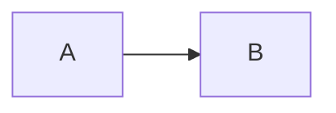

# Asset Management — User Manual

The official user manual / help center for the Asset Management System.

This is a **standalone, frontend-only React application**. It has no backend, no
database, no API client and no authentication. `npm run build` produces a folder
of static files that any web server — or none at all — can serve.

```text
React 19 · Vite 7 · JavaScript (no TypeScript) · Tailwind CSS v4 · React Router 7
react-markdown + remark-gfm · MiniSearch · Mermaid (lazy) · Vitest + Testing Library
```

---

## Independence from the rest of the repository

This workspace is **deliberately not part of the root npm workspaces**. It has
its own `node_modules` and its own lockfile, installs on its own, and shares no
build step with `apps/api` or `apps/web`.

That is the point: the manual must never be able to break the application, and
the application must never be needed to build the manual. Nothing here imports
from `apps/web`; where the two share something — the brand palette, the
Indonesian vocabulary — the values are **copied with a comment saying so**, not
imported.

```bash
cd apps/manual
npm install
```

---

## Commands

| Command | What it does |
| --- | --- |
| `npm run dev` | Development server on <http://localhost:5175> |
| `npm run build` | Static build into `dist/` |
| `npm run preview` | Serve the built `dist/` on <http://localhost:4175> |
| `npm test` | Vitest suite |
| `npm run lint` | ESLint |

---

## Deployment

`npm run build` writes `dist/`. Upload it. There is nothing else to configure.

Vercel, Netlify, Cloudflare Pages, GitHub Pages, an Nginx directory, an intranet
file share, a USB stick — all work unchanged, because two decisions were made for
exactly this:

- **`base: './'`** in `vite.config.js` — assets are referenced relatively, so the
  same build works at a domain root and under a sub-path (`/manual/`).
- **A hash router** — routes look like `#/assets/creating-an-asset`. No server
  rewrite rule is needed, so a bookmarked deep link cannot 404 on a host nobody
  configured.

To trade the `#` for clean URLs: use `createBrowserRouter` in `src/routes.jsx`,
set `base: '/'`, and add an SPA rewrite on the host. Nothing else changes —
heading anchors already go through the router rather than through raw `href`s.

---

## Writing content

Content is Markdown under `src/content/<language>/<section>/<slug>.md`, and the
path is the route:

```text
src/content/en/assets/registering-an-asset.md   →   #/assets/registering-an-asset
src/content/id/assets/registering-an-asset.md   →   the same route, in Indonesian
```

**Adding an article requires no React changes.** One manifest
(`src/lib/manifest.js`) reads every file at build time and derives the sidebar,
the breadcrumbs, the section index pages, previous/next, the related links and
the search index from it.

### Frontmatter

```markdown
---
title: Creating an asset
description: Register a new master record for a kind of item.
order: 10
task: true
permissions:
  - asset:create
keywords: [new asset, register, add]
related:
  - concepts/asset-vs-asset-unit
---
```

| Key | Required | Meaning |
| --- | --- | --- |
| `title` | Yes | Heading, sidebar label, search title |
| `description` | Recommended | Sub-heading, section index blurb, search excerpt |
| `order` | No | Position within the section (default 999) |
| `task` | No | `true` lists it under **How Do I…?** and on the home page |
| `permissions` | No | Rendered as a "Requires permission" strip |
| `keywords` | No | Extra search terms that need not appear in the prose |
| `related` | No | `section/slug` paths, rendered as cards at the foot |

Sections themselves are declared in `src/content/sections.js`. A folder that is
not declared there is reported as a content problem and not rendered.

### Markdown extensions

Plain Markdown, plus five conventions that all degrade gracefully in any other
Markdown viewer:

````markdown
> [!TIP]
> Callout. Also NOTE, IMPORTANT, WARNING, CAUTION, LIMITATION.

`perm:asset:create`     → a permission badge
`state:BORROWED`        → a status badge (`state:borrowing/ACTIVE` to disambiguate)

   → a screenshot slot


````

No MDX. Content stays editable by whoever operates the application.

### Screenshots

There are none yet, and none have been invented. Articles reference the file
they *would* use; until it exists, a labelled placeholder renders in its place
and the written steps stand alone. Drop a real capture at the matching path
under `public/screenshots/` and it appears — no content change required.

---

## Translations

English is the spine: it decides which articles exist and in what order. An
Indonesian file supplies a translation of an article that already exists.

When a translation is missing, the English text renders with a visible notice
rather than a 404. Terminology follows the application's own catalogue
(`apps/web/src/i18n/id.js`) — *Instansi*, *Bagian*, *Penyedia*, *Denah* — so a
word in the manual matches the word on screen.

Permission codes, stored enum values and route paths are never translated.

---

## Source of truth

The manual documents **the application as it behaves today**, verified against
the running source in `apps/api` and `apps/web`. Where the specification in
`docs/` and the implementation disagree, the manual describes the implementation
and says so in a callout. It never describes behaviour that does not exist.
