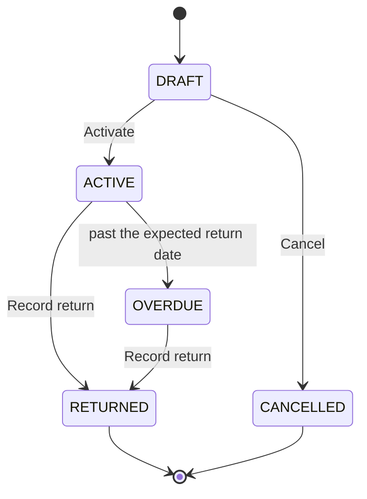

A borrowing is an **event**: one record covering one or more asset units lent out
together. It moves through five statuses, and the status decides which buttons
you are offered.

## The lifecycle

## What each status means

### `state:borrowing/DRAFT`

The record exists but nothing has been lent yet. This is where you add the units
the loan covers.

- **You can** edit every field, add and remove units, activate it, or cancel it.
- **You cannot** activate it with no units on it.
- **The units** are untouched. A draft holds nothing, so the same unit may appear
  on two drafts at once — only activation decides who actually gets it.

### `state:borrowing/ACTIVE`

The loan is running. The borrower has the items.

- **You can** record the return, or extend the loan.
- **You cannot** edit the header or change which units are covered. The
  composition is fixed at activation.
- **The units** have each moved to `state:BORROWED`.

### `state:borrowing/OVERDUE`

The loan is still running, and the expected return date has passed.

- **You can** do exactly what you could do while active: record the return, or
  extend.
- **The units** are still `state:BORROWED`, because they are still out.

Nobody sets this by hand. A scheduled job stamps it overnight on every active
loan whose expected return date has passed. The dates themselves are never
altered — only the status.

### `state:borrowing/RETURNED`

Closed. The items came back.

- **You can** read it. Nothing else.
- **The units** have moved back to `state:ACTIVE`.
- **The record keeps its original dates** — borrow date, expected return, actual
  return — permanently.

### `state:borrowing/CANCELLED`

A draft that was abandoned.

- **You can** read it. A cancelled draft cannot be reopened.
- **The units** never changed state, because a draft never held them.

## Extending a loan

Extending does **not** push the date on the existing record. It closes the
current borrowing as returned on the closing date you give, then opens a **new
draft** over the same units with the new expected return date.

That is deliberate: it keeps what actually happened — the first loan really did
run to its original date — instead of rewriting it.

> [!LIMITATION]
> Nothing links the new borrowing back to the one it continued. The chain exists
> in the units' history, but you cannot click from one record to the other. If
> the connection matters to you, note it in the new record's description.

## What you will not find

> [!LIMITATION]
> The borrowings list has filters for status, institution and overdue, but **no
> date-range filter**. To find loans by date, use the **Borrowings report**
> under Reports, which does have them.
