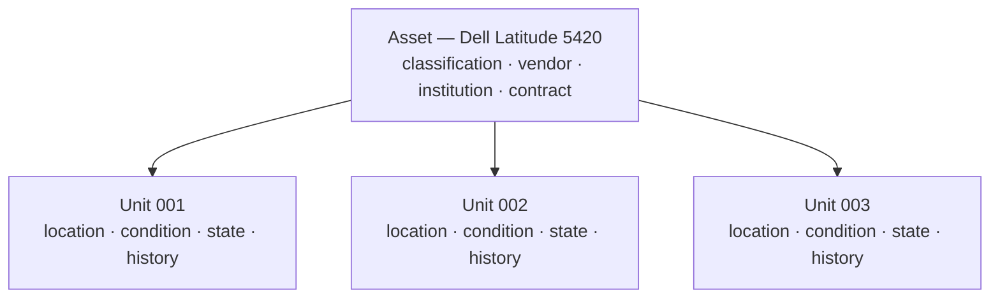

The application separates the **kind of thing** from the **individual things**.
Every screen, every report and every permission depends on that separation, so it
is worth five minutes.

## A worked example

Your institution buys three identical laptops.

You create **one asset**:

```text
Asset: Dell Latitude 5420
```

and **three asset units** beneath it:

```text
Asset: Dell Latitude 5420
├── Dell Latitude 5420 — Unit 001
├── Dell Latitude 5420 — Unit 002
└── Dell Latitude 5420 — Unit 003
```

The asset records what is true of all three: the classification, the vendor
(Dell), the owning institution, the contract they were bought under.

Then reality happens to them individually:

| | Location | Condition | Lifecycle state |
|---|---|---|---|
| Unit 001 | Room 204 | `state:GOOD` | `state:lifecycle/ACTIVE` |
| Unit 002 | Store room | `state:GOOD` | `state:IN_STORAGE` |
| Unit 003 | With a staff member | `state:FAIR` | `state:BORROWED` |

None of that is a property of "Dell Latitude 5420" as a model. All of it is a
property of one machine.

## The rule

> [!IMPORTANT]
> The **unit** is what has a location, a condition, a lifecycle state and a
> history. The **asset** has none of those.



## Side by side

| | Asset | Asset Unit |
|---|---|---|
| What it is | The master record for a kind of item | One individual physical item |
| How many | One record | One record per physical item |
| Location | — | Yes |
| Condition | — | Yes |
| Lifecycle state | — | Yes |
| History timeline | — | Yes |
| Can be borrowed | — | Yes |
| Appears on a transaction | — | Yes |
| Responsible department | — | Yes |
| Classification | Yes | Inherited from its asset |
| Vendor | Yes | Inherited from its asset |
| Institution | Yes | Inherited from its asset |
| Attachments | Yes | — |
| Attribute values | Asset-scoped ones | Unit-scoped ones |

## Why not track only individual items?

Because facts true of the whole batch would then be stored three times and drift
apart. Change the vendor on one laptop and the other two would quietly disagree.

## Why not track only the model?

Because you cannot lend out a model, put it in a room, or record that it was
dropped. Accountability needs individual objects.

## How this shows up on screen

Opening an asset gives you a page with tabs:

- **Overview** — the master record, and the contract line if it came from one
- **Units** — the individual physical items
- **Attribute values** — extra fields for the asset as a whole
- **Attachments** — files

Choosing a unit from that list opens the unit's own page, with its own tabs:
**Overview**, **Attribute values**, **History**, **Borrowings**, **Transactions**.

> [!TIP]
> If you are looking for a room, a condition, a loan or a history and cannot find
> it, you are on the asset page when you want the unit page. Open the **Units**
> tab and pick the item.

## Attributes exist at both levels

Extra fields are configured against a classification, and each one is declared as
belonging either to the asset or to the unit:

- **Asset attributes** describe the kind of thing — screen size, processor model.
  The same for every unit.
- **Unit attributes** describe one physical item — serial number, asset tag.
  Different for every unit.

See [Attributes](/concepts/attributes).

## An asset with no units

Allowed, and it means something specific: something registered but not yet
physically received. The empty Units tab says so.

## Related articles

- [Asset](/concepts/asset)
- [Asset Unit](/concepts/asset-unit)
- [How do I add asset units?](/how-do-i/add-an-asset-unit)
