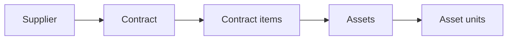

A **contract** is the procurement record: the agreement under which your
organization bought something. It is the top of the chain that puts most assets
onto the registry.

The application records contracts. It does not raise them, approve them or
process payment — those happen elsewhere, and what you enter here is a record of
an agreement that already exists.

## Where it sits

## What a contract holds

| Field | Required | Notes |
|---|---|---|
| Contract number | Yes | Must be unique. Up to 150 characters |
| Contract date | Yes | The date of the agreement |
| Supplier | No | The party it was executed with |
| Contract type | No | From your own list of types |
| Funding source | No | Where the money came from |
| Contract value | No | Numeric, two decimal places |
| Account code | No | From your own list of account codes |
| Institution | No | The receiving institution. Defaults to yours |
| Receiving document | No | A reference for the delivery paperwork |
| Receiving date | No | Leave empty until goods arrive |
| Notes | No | Free text |

Contract types, funding sources and account codes are lists you maintain
yourself — see [Reference lookups](/administration/reference-lookups). Suppliers,
contract types and funding sources can also be created without leaving the
contract form.

## Received or not

**Receiving date** is how a contract says whether the goods have arrived. Left
empty, the contract shows as *Not received yet*. It is a record of fact, not a
switch that changes anything — registering assets does not depend on it.

## Line items are separate

A contract on its own buys nothing in particular. What was actually purchased is
recorded as [contract items](/concepts/contract-item), added after the contract
exists.

## Editing a contract

Contracts can be edited freely. Changing the header — value, dates, supplier —
does not disturb the line items or the assets traced to them.

## Deactivating

Contracts are deactivated rather than deleted. Assets already traced to one keep
their link.

## Related articles

- [Contract item](/concepts/contract-item)
- [Vendor vs Supplier](/concepts/vendor-vs-supplier)
- [How do I create a contract?](/how-do-i/create-a-contract)
