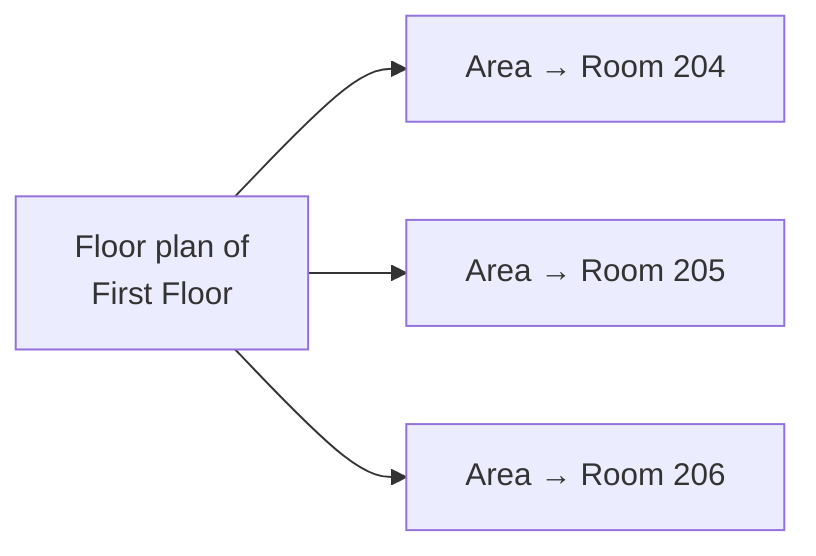

A **floor plan** is an image belonging to a [location](/concepts/location), with
shapes drawn on it. Each shape marks out a location *inside* the one the plan
depicts.

It turns "Cabinet A, Room 204, First Floor" from a line of text into somewhere
you can point at.

## How it fits together

A plan belongs to one location. The shapes on it — called **areas** — each
represent one location nested inside that one.

So the plan of a floor marks out its rooms; the plan of a site marks out its
buildings. Any location can have one.

## The descendancy rule

An area may only point at a location that is genuinely **inside** the location
the plan belongs to — at any depth, but inside it.

> [!IMPORTANT]
> You cannot draw a room from another building onto this floor's plan. The
> application refuses it, because a plan that marked out somewhere it does not
> contain would be actively misleading.

## Trails of plans

Because plans exist at whatever level someone chose to photograph, the plan that
places a unit is usually **above** it in the hierarchy.

The application handles this by offering a **trail**: open the site plan to see
which building, then the building plan to see which room, as far in as the plans
go. Each step highlights the next one down.

A unit's Overview tab shows this trail. If no plan exists at any level above the
unit, it says so.

## What a plan is made of

| | |
|---|---|
| Image | A JPEG or PNG. Up to 10 MB |
| Areas | Shapes of at least three corners, each linked to a descendant location |

Shapes are stored relative to the image rather than in pixels, so a plan still
lines up correctly on a phone and on a large monitor.

## Editing areas

> [!LIMITATION]
> An area's shape cannot be adjusted corner by corner. To change a shape you
> delete the area and draw it again. In practice this is a minor nuisance —
> rooms rarely move — but budget a redraw rather than a nudge.

Deleting an area, or the whole plan, has **no effect on the locations
themselves**. The plan is a picture of the hierarchy, not the hierarchy.

## Replacing a plan

Uploading a new image over an existing plan removes every area drawn on the old
one. That is unavoidable: the shapes were positioned against the old picture. Be
ready to redraw.

## Related articles

- [Location](/concepts/location)
- [How do I upload a floor plan?](/how-do-i/upload-a-floor-plan)
- [How do I create areas on a floor plan?](/how-do-i/create-floor-plan-areas)
