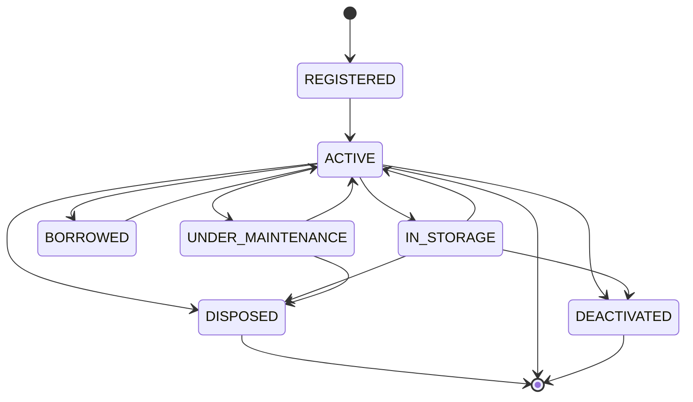

A **lifecycle state** says where an [asset unit](/concepts/asset-unit) is in its
working life. It answers "is this thing in service?" — a different question from
[condition](/concepts/condition), which answers "what state is it in?".

A unit is in exactly one lifecycle state at a time.

## The seven states

| State | What it means |
|---|---|
| `state:REGISTERED` | On the books, not yet in service. No condition or location recorded |
| `state:lifecycle/ACTIVE` | In use |
| `state:IN_STORAGE` | Held in reserve, not currently in use |
| `state:BORROWED` | Out on loan. Set by the application, not by hand |
| `state:UNDER_MAINTENANCE` | Away being repaired or serviced |
| `state:DISPOSED` | Written off, sold or scrapped. Permanent |
| `state:DEACTIVATED` | Taken out of the register. Permanent |

## Which changes are allowed

Not every state can follow every other. The application enforces a fixed path:

Read practically:

- A newly registered unit can only become **in use**. Everything starts by
  entering service.
- **In use** is the hub. From there a unit can go to storage, out on loan, into
  maintenance, or out of the register entirely.
- A unit **in storage** goes back into use, or straight out of the register.
- A unit **on loan** or **under maintenance** returns to use.
- A unit **under maintenance** can be disposed of if it turns out to be beyond
  repair.

> [!IMPORTANT]
> `state:DISPOSED` and `state:DEACTIVATED` are the end. A unit in either cannot
> change state again, ever. That is deliberate — bringing one back would rewrite
> a history the register is supposed to preserve. If something genuinely comes
> back into service, register it as a new unit.

If you try an impossible change, the application refuses and tells you which
states *are* available from where the unit is now.

## Two states you do not set by hand

- `state:BORROWED` is set when a [borrowing](/concepts/borrowing) is activated,
  and cleared when it is returned. Do not set it manually; use the borrowing.
- `state:REGISTERED` is the state a unit is created in.

## Changing a lifecycle state

Through **Record a change** on the unit's History tab, alongside condition and
location. See
[How do I change a unit's lifecycle state?](/how-do-i/change-a-unit-lifecycle-state).

## Lifecycle state is not the same as active/inactive

Two different ideas that both use the word "active":

- **Lifecycle state** describes the physical item's working life.
- **[Active / inactive](/concepts/active-and-inactive)** describes whether the
  *record* is in current use.

A unit record can be deactivated regardless of its lifecycle state.

## Related articles

- [Condition](/concepts/condition)
- [History](/concepts/history)
- [Statuses reference](/reference/statuses)
