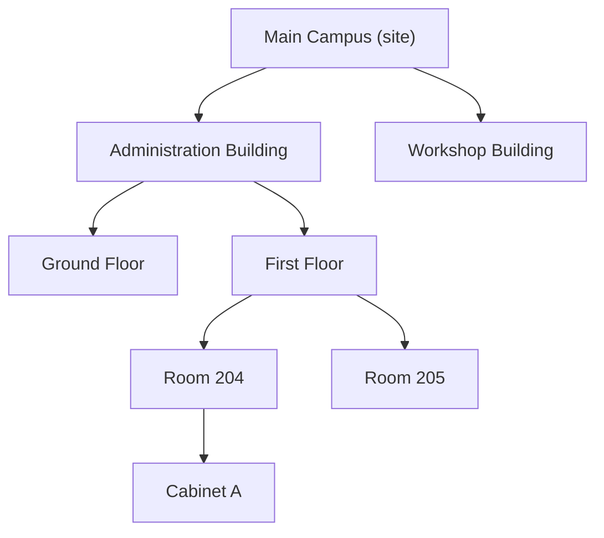

A **location** is a place an [asset unit](/concepts/asset-unit) can be. A site, a
building, a floor, a room, a cupboard — the application does not impose a fixed
set of levels, and you decide how finely to divide your estate.

## Locations nest

Every location can sit inside another one. That containment is the whole idea:

A location with no parent is a **top-level** location — typically a site or a
campus. Everything else names the location it sits inside.

You can go as deep as you find useful. Nothing counts the levels, and there is no
requirement to have exactly site → building → floor → room.

## How deep should you go?

Deep enough to find things, shallow enough to maintain. A useful rule: create a
location if you would ever say "it is in there" and expect someone to be able to
walk to it.

Recording a unit as being in "Administration Building" is legitimate if that is
genuinely as precise as your records get.

## What a location holds

| | |
|---|---|
| Name | Required |
| Classification | Required. From the same hierarchy assets use, most specific level only |
| Parent location | Optional. Empty means top-level |
| Institution | Which institution it belongs to |
| Floor plan | Optional. See [Floor plan](/concepts/floor-plan) |
| Units | Everything currently recorded there |
| Child locations | Everything recorded inside it |

## Two ways to ask "what is in here?"

A location page's **Units** tab has a scope control with two settings, and the
difference matters:

- **Here only** — units whose location is exactly this one.
- **Including inside** — units here *and* in every location nested within, at any
  depth.

Ask "Including inside" on a building to inventory the whole building. Ask "Here
only" on a room to see what is actually in that room. See
[Viewing what is in a location](/locations/units-in-a-location).

## Locations cannot be tangled

Two rules stop the hierarchy folding in on itself:

- A location cannot be its own parent.
- A location cannot be moved inside one of its own descendants.

The second is the one you may meet: you cannot make a building sit inside one of
its own rooms.

## Deactivating a location

Locations are deactivated, never deleted. Units recorded there keep their
location history; the location stops being offered for new placements. See
[Active and inactive](/concepts/active-and-inactive).

## How a unit gets a location

Not by editing the unit. A unit's location is a historical fact, recorded through
**Record a change** on its History tab, together with its condition and lifecycle
state. See
[How do I move an asset unit?](/how-do-i/move-an-asset-unit).

## Related articles

- [Floor plan](/concepts/floor-plan)
- [Viewing what is in a location](/locations/units-in-a-location)
- [How do I create a location?](/how-do-i/create-a-location)
