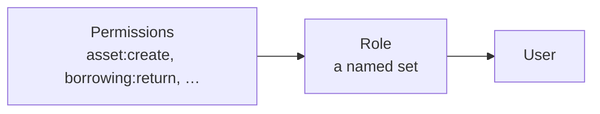

Access is granted in two steps: permissions go into roles, and roles go onto
users.

Nobody holds a permission directly. That indirection is what makes access
manageable: change the role, and everyone holding it changes with it.

## Permissions

A permission names one action on one kind of record, written `resource:action`:
`perm:asset:read`, `perm:contract:create`, `perm:borrowing:return`.

There are **104**, grouped by module — Organization, Reference, Asset Core,
Procurement, Operations, Reports, Audit. The full list is in
[Permission reference](/reference/permission-reference), and the role screen
presents them as a grouped checklist rather than a flat list.

The actions in use are:

| Action | Meaning |
|---|---|
| `read` | View |
| `create` | Add a new one |
| `update` | Change an existing one |
| `deactivate` | Deactivate and reactivate |
| `delete` | Permanently remove (only where deletion exists at all) |
| Named actions | Specific operations: `activate`, `cancel`, `return`, `extend`, `record-history` |

The named actions are why borrowing has seven permissions rather than four:
authorising someone to *create* a loan is not the same as authorising them to
*return* one.

## Roles

A role is a name and a set of permissions. Your organization creates its own —
there is no fixed catalogue of job titles, and a role called "Storekeeper" on one
installation may not exist on another.

Exactly one role exists out of the box: **System Admin**, system-wide, holding
every permission. It has no special powers built into the application; it can do
everything because it has been *granted* everything, visible on its own
permissions tab like any other role.

## System-wide roles

A role can be marked **system-wide**. This lifts the institution boundary from
the permissions that role carries — a system-wide role sees every institution's
records.

> [!IMPORTANT]
> System-wide grants nothing on its own. It only removes the scope restriction
> from permissions the role already has. A system-wide role with no permissions
> can still do nothing.

Some permissions only make sense system-wide, and the role screen marks them
**Requires a system-wide role**: managing institutions, roles, the permission
catalogue and role assignments. Turning system-wide off is refused while any of
those are granted.

## Assigning roles to users

A user holds any number of roles, and their effective permissions are everything
those roles carry between them. Removing every role leaves an account that can
sign in and do nothing.

Role changes take effect immediately — a user does not need to sign out and back
in.

## Deleting a role

Roles are the one organizational record that is genuinely deleted rather than
deactivated. The deletion is refused while any user still holds the role, so
remove it from users first.

## Related articles

- [Understanding permissions](/getting-started/understanding-permissions)
- [How do I create a role?](/how-do-i/create-a-role)
- [Permission reference](/reference/permission-reference)
