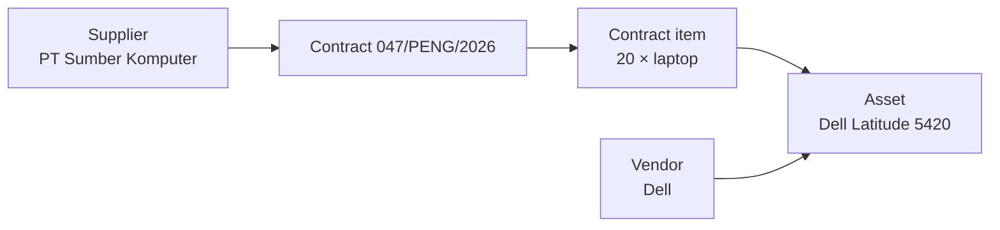

Two words that sound interchangeable and are not. The application keeps separate
lists for them because they answer different questions.

## The distinction

| | Vendor | Supplier |
|---|---|---|
| Who it is | The **manufacturer or brand** | The **party you signed the contract with** |
| Question it answers | Who made this? | Who did we buy it from? |
| Attached to | An [asset](/concepts/asset) | A [contract](/concepts/contract) |
| Found under | Operations → Vendors | Procurement → Suppliers |
| Example | Dell | PT Sumber Komputer |

## A worked example

Your institution buys twenty Dell laptops through a local supplier under contract
`047/PENG/2026`.

- The **supplier** is the company that won the tender and delivered them. It goes
  on the contract.
- The **vendor** is Dell. It goes on the asset.

Next year you buy more Dell laptops through a different company. The vendor is
the same; the supplier is not. Keeping them apart is what lets you ask both "how
much Dell equipment do we own?" and "what have we bought from this company?"

The supplier reaches the asset **through the contract**. The vendor attaches to
the asset directly.

## When there is no vendor

Optional, always. Leave it as *No vendor* when the manufacturer is unknown,
irrelevant, or the item was made in-house. Nothing depends on it being filled in.

## When there is no supplier

Also possible. A contract can be recorded without naming a supplier, and an asset
registered directly has no contract at all — so no supplier either. Donated,
self-built and migrated items are the usual cases.

## What each record holds

Both are short records with the same three fields:

| Field | Required | Notes |
|---|---|---|
| Name | Yes | Up to 255 characters |
| Contact information | No | Free text — phone, email, contact person |
| Address | No | Free text |

## What each page shows you

- A **vendor** page lists the assets attributed to it, within your organization
  scope. Useful for "what Dell equipment do we have?".
- A **supplier** page lists the contracts executed with it. Useful for "what have
  we bought from this company?".

## Deactivating

Both are deactivated rather than deleted. Existing records keep their reference;
the entry stops being offered on new ones. Reactivating makes it selectable
again.

## Related articles

- [Contract](/concepts/contract)
- [How do I create a supplier?](/how-do-i/create-a-supplier)
- [How do I create a vendor?](/how-do-i/create-a-vendor)
