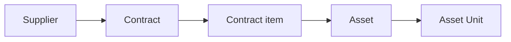

This manual is a folder of Markdown files. Correcting a page means editing one
file — no React, no build configuration, no component syntax.

This page is also the reference render: every feature below appears on it, so if
something is broken you will see it here first.

## Where the files are

```text
src/content/<language>/<section>/<slug>.md
```

The path is the address. `src/content/en/assets/registering-an-asset.md` is
served at `#/assets/registering-an-asset`, and the Indonesian translation of the
same article lives at `src/content/id/assets/registering-an-asset.md`.

Sections are declared in `src/content/sections.js`. A folder that is not declared
there will not be rendered.

## Frontmatter

Every file opens with a metadata block:

```yaml
---
title: Creating an asset
description: Register a new master record for a kind of item.
order: 10
task: true
permissions:
  - asset:create
keywords: [new asset, register, add]
related:
  - concepts/asset-vs-asset-unit
---
```

| Key | Required | What it does |
|---|---|---|
| `title` | Yes | The heading, the sidebar label and the search title |
| `description` | Yes | The sub-heading, the section-index blurb and the search excerpt |
| `order` | No | Position within the section. Lower comes first; the default is 999 |
| `task` | No | `true` lists the article under **How Do I…?** and on the home page |
| `permissions` | No | Rendered as a "Requires permission" strip under the title |
| `keywords` | No | Extra search terms that need not appear in the prose |
| `related` | No | `section/slug` paths, rendered as cards at the foot of the article |

Everything else — the sidebar, the breadcrumbs, previous/next, the section index
and the search index — is derived. There is no list of articles to update.

## Headings

Use `##` for the main sections of an article and `###` beneath them. Do not write
a `#` heading: the title comes from the frontmatter and is rendered above the
body.

Only `##` and `###` appear in the "On this page" rail on the right.

## Callouts

Written as GitHub-style alerts, so they still read correctly in any Markdown
editor:

```markdown
> [!TIP]
> Press Ctrl-K to open search from anywhere.
```

> [!NOTE]
> Neutral background information. The reader can carry on without it.

> [!TIP]
> A shortcut or a better way of doing the same thing.

> [!IMPORTANT]
> Something the reader must understand for the rest of the page to make sense.

> [!WARNING]
> Something that will go wrong if ignored.

> [!CAUTION]
> An action that cannot be undone.

> [!LIMITATION]
> Something the application genuinely cannot do today. Used sparingly, and only
> where it saves the reader from hunting for a feature that is not there.

Use them sparingly. A page of callouts has no emphasis left.

## Badges

Two inline conventions, both written as ordinary code spans:

| You write | You get |
|---|---|
| `` `perm:asset:create` `` | `perm:asset:create` |
| `` `state:BORROWED` `` | `state:BORROWED` |
| `` `state:GOOD` `` | `state:GOOD` |
| `` `state:borrowing/ACTIVE` `` | `state:borrowing/ACTIVE` |
| `` `state:lifecycle/ACTIVE` `` | `state:lifecycle/ACTIVE` |

A status badge shows the label the application displays **and** the stored value
underneath, because a reader will meet both — one on a badge, the other in a
report, an audit entry or an error message.

`ACTIVE` exists in two families, so name the family when it is ambiguous.

## Tables

Ordinary GFM tables. They scroll sideways inside their own frame rather than
stretching the page, so a wide field reference stays readable on a phone.

| Field | Required | Description |
|---|---|---|
| Name | Yes | Up to 255 characters. |
| Classification | Yes | Only the most specific level can be chosen. |
| Institution | No | Defaults to your own institution. |
| Vendor | No | The manufacturer or brand behind the asset. |
| Description | No | Up to 5,000 characters. |

## Procedures

Numbered lists are styled as steps. Keep one action per step.

1. Open **Assets** in the sidebar.
2. Select **New asset**.
3. Enter the required information.
4. Select **Create asset**.

Bulleted lists are for things that are not sequential:

- Something true
- Something else true
  - And a detail beneath it

Task lists work too, for checklists a reader ticks off on paper:

- [x] Contract recorded
- [ ] Line items added
- [ ] Assets registered

## Diagrams

Fenced `mermaid` blocks render as diagrams and follow the light or dark theme.



Keep them to the shape of a process. A diagram that needs a key is a table.

## Screenshots

Reference the image you *would* use:

```markdown

```

If the file does not exist yet, a labelled placeholder renders instead:


Drop a real capture at the matching path under `public/screenshots/` and it
appears — no change to the article.

> [!IMPORTANT]
> Never write instructions that only make sense next to a picture. The steps must
> stand on their own; the screenshot is confirmation, not the instruction.

## Links

Internal links use the route: `[Asset vs Asset Unit](/concepts/asset-vs-asset-unit)`.
A link to a section works too: [Troubleshooting](/troubleshooting).

Links to a heading within an article use its anchor:
[the callouts above](#callouts).

External links open in a new tab and are marked: [Mermaid syntax](https://mermaid.js.org).

A build-time test checks that every internal link points at an article that
exists, so a renamed file cannot leave a dead link behind.

## Code and values

Inline code is for field names, stored values and file names: `contractNumber`,
`UNDER_MAINTENANCE`, `rincian_asset.csv`.

Fenced blocks are for anything longer:

```text
Supplier → Contract → Contract item → Asset → Asset Unit → Location
```

## Translating

Copy the English file to the same path under `src/content/id/`, translate the
body and the frontmatter's `title` and `description`, and leave `order`,
`task`, `permissions` and `related` exactly as they are.

Never translate a permission code, a stored value such as `DISPOSED`, or a route
in a link. Use the application's own Indonesian words for domain terms — *Aset*,
*Unit aset*, *Instansi*, *Bagian*, *Penyedia*, *Denah* — so the manual matches
what is on screen.

Until a translation exists, the English article is shown with a notice. A missing
translation is never a missing page.
