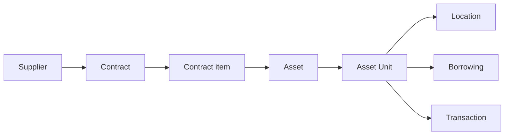

The Asset Management System is the official record of the physical things your
organization owns — the computers, furniture, vehicles, equipment and fittings
that belong to an institution and have to be accounted for.

It answers, for any one of those items:

- What is it, and what kind of thing is it?
- Which institution owns it, and which department is responsible for it?
- Where is it right now?
- What condition is it in?
- Where did it come from — which contract, which supplier?
- Is anyone borrowing it?
- What has happened to it since it was registered?

## Who this manual is for

Anyone who uses the application: the staff who register what arrives, the people
who move items between rooms and record their condition, whoever lends equipment
out and chases it back, and the administrators who set all of that up.

You do not need to know anything about databases or programming to use this
manual. Where the application does something for a technical reason, this manual
explains what it means for you, not why it was built that way.

## The shape of the system

Everything in the application hangs off two ideas that look similar and are not:

- An **Asset** is the master record for a kind of thing — "Dell Latitude 5420
  laptop".
- An **Asset Unit** is one individual physical item of that kind — the actual
  laptop sitting on a desk in Room 204.

> [!IMPORTANT]
> Asset and Asset Unit are the single most important distinction in this
> application. Almost every question that starts "why can't I…" turns out to be
> one of them being confused for the other. Read
> [Asset vs Asset Unit](/concepts/asset-vs-asset-unit) before anything else.

Around those two, the rest of the system organizes itself:

Read that as a sentence: you buy things from a **supplier** under a **contract**;
each line of that contract is a **contract item**; registering a line puts an
**asset** on the books along with its individual **units**; each unit sits in a
**location**, can be **borrowed**, and accumulates **transactions**.

Not everything arrives that way. Donated, self-built and inherited items are
registered directly, with no contract behind them — that is a normal, expected
case, not missing data.

## What the application is not

- It is not a purchasing system. It records contracts that already exist; it does
  not raise orders or approve spending.
- It is not an accounting ledger. It records a contract value and an account
  code, but does no depreciation, valuation or posting.
- It is not a maintenance scheduler. You can record that a unit is under
  maintenance; the application will not tell you when to service it.

## Where to go next

- [Signing in](/getting-started/signing-in) — getting into the application.
- [Finding your way around](/getting-started/finding-your-way-around) — the
  sidebar, search and the shape of a screen.
- [How Do I…?](/how-do-i) — step-by-step instructions for common tasks.
