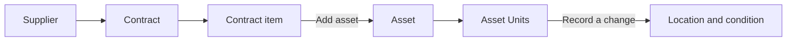

## What is this?

This is the main way things get onto the registry. Instead of typing an asset out
by hand and then trying to remember which contract it came from, you register it
**from** the contract line — and the link between the two is made for you.

Use [Create an asset](/how-do-i/create-an-asset) instead for anything with no
contract behind it.

## Before you begin

- The contract must exist, with the line item you are registering already on it.
- You need the **classification** for the item. The contract line does not carry
  one, so it is the one thing you must supply here.
- Know **how many units actually arrived**. It does not have to match the
  quantity ordered.

## Steps

1. Open **Procurement › Contracts** and select the contract.
2. Find the line item in the **Line items** table.
3. Select **Add asset** on that row.
4. Check the **Name** — it is pre-filled from the line item and can be edited.
5. Select the **Classification**. Only the most specific level can be chosen.
6. Choose a **Vendor** if you want to record the manufacturer.
7. Set **Asset units to register**. This is pre-filled with the quantity ordered.
8. Add a **Description** if it helps.
9. Select **Create asset**.

## Field reference

| Field | Required | Notes |
|---|---|---|
| Name | Yes | Pre-filled from the line item. Up to 255 characters. |
| Classification | Yes | The contract line carries none, so it is chosen here. Most specific level only. |
| Vendor | No | The manufacturer or brand. |
| Asset units to register | Yes | A whole number from 1 to 500. Pre-filled with the quantity ordered. |
| Description | No | Up to 5,000 characters. |

> [!TIP]
> Registering fewer units than were ordered is normal, not an error. Partial
> deliveries are expected — register what arrived, and register the rest against
> the same line item when it turns up.

## What happens next?

In one step the application creates:

- **One asset**, already traced to this contract. Its detail page shows the
  contract number, and you did not have to type it.
- **As many asset units** as you asked for, each carrying the contract line it
  came from.

Every unit starts at `state:REGISTERED` with no condition and no location, exactly
as if you had added them by hand. The next step is the same too: record each
unit's first condition and location to bring it into service.

The line item's own panel now lists the units registered against it, so you can
see at a glance how much of an order has actually arrived.

## The wider workflow

## Related tasks

- [How do I create an asset?](/how-do-i/create-an-asset)
- [How do I assign a location?](/how-do-i/assign-a-location)
