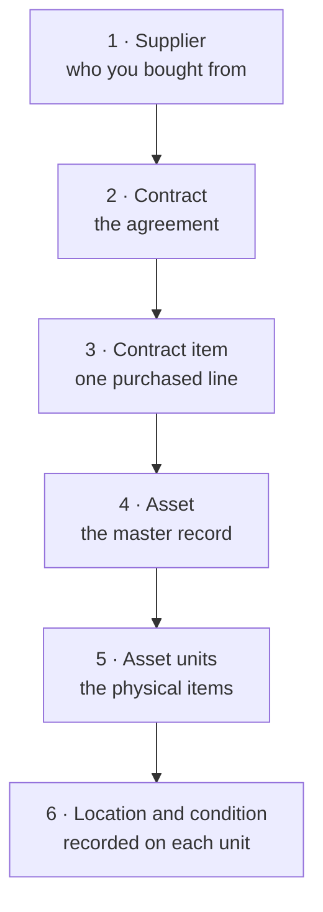

This is the main way things get onto the registry. Five records, in order, each
one created from the last.

The value of following it in order is that each step **fills in the next one for
you**. Register an asset from a contract line and the link back to the contract
is made automatically — you never type a contract number onto an asset, and the
**Procurement traceability** report works without anyone maintaining it.

## Step by step

### 1. The supplier

Record who you bought from, if it is not already on file. See
[How do I create a supplier?](/how-do-i/create-a-supplier).

You can also create one from within the contract form, so a missing supplier does
not interrupt you.

### 2. The contract

Record the agreement: number, date, value, funding source. See
[How do I create a contract?](/how-do-i/create-a-contract).

At this point nothing has been bought in particular. The contract is a header.

### 3. The line items

Record what was actually purchased, one line per kind of thing: "20 laptops",
"5 filing cabinets". See
[How do I add contract items?](/how-do-i/add-contract-items).

How you split the lines decides how your registry is shaped, because each line
becomes one asset.

### 4 and 5. The assets and their units

As the goods arrive, use **Add asset** on the line item. In one step this creates
the [asset](/concepts/asset) and as many
[units](/concepts/asset-unit) as actually turned up. See
[How do I register an asset from a contract?](/how-do-i/register-an-asset-from-a-contract).

The one thing you must supply here is the
[classification](/concepts/classification) — the contract paperwork does not
carry one.

### 6. Bringing the units into service

Newly created units are `state:REGISTERED` with no condition and no location.
Record each unit's first change to bring it into service. See
[How do I record a change to an asset unit?](/how-do-i/record-a-change-to-a-unit).

Only then is the item genuinely on the register: findable by location, reportable
by condition, and available to be borrowed.

## Partial deliveries

The quantity on a line item is what was **ordered** and never changes. The units
you register are what **arrived**.

> [!IMPORTANT]
> Registering fewer units than were ordered is expected, not an error. Register
> what came, and register the rest against the same line item when it turns up.
> The line item's panel shows both numbers, so the gap between them is your
> outstanding delivery.

## When there is no contract

Plenty of things are not bought: donations, items built in-house, transfers,
records migrated from an older system. They are registered directly and have no
procurement record at all — a documented, normal case. See
[How do I register an asset directly?](/how-do-i/register-an-asset-directly).

> [!IMPORTANT]
> Decide which path applies **before** creating the asset. An asset's procurement
> line is set once, at creation, and a contract cannot be attached afterwards.

## Checking what has been traced

The **Procurement traceability** report shows which assets trace back to a
contract and how many of their units carry the line item — which is how you find
things registered directly that should have been registered from a contract. See
[The eight reports](/reports/the-eight-reports).

## Related articles

- [Contract](/concepts/contract)
- [Contract item](/concepts/contract-item)
- [Vendor vs Supplier](/concepts/vendor-vs-supplier)
