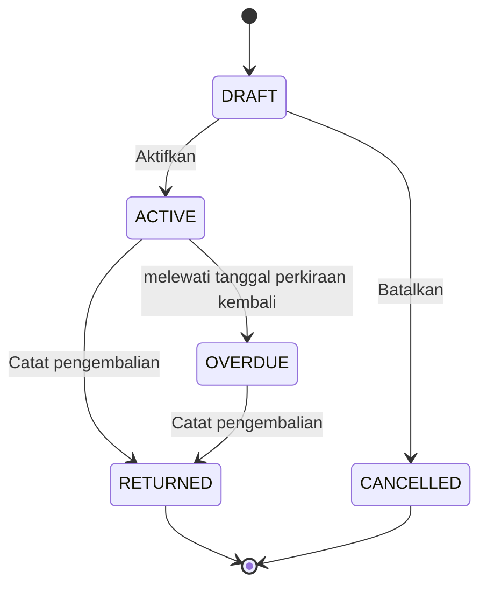

Peminjaman adalah sebuah **kejadian**: satu catatan yang mencakup satu atau
beberapa unit aset yang dipinjamkan bersama. Ia melewati lima status, dan
statusnya menentukan tombol apa yang ditawarkan kepada Anda.

## Siklusnya

## Arti setiap status

### `state:borrowing/DRAFT`

Catatannya ada tetapi belum ada yang dipinjamkan. Di sinilah Anda menambahkan
unit yang dicakup peminjaman.

- **Anda dapat** menyunting setiap kolom, menambah dan melepas unit,
  mengaktifkan, atau membatalkan.
- **Anda tidak dapat** mengaktifkannya tanpa unit sama sekali.
- **Unitnya** tidak tersentuh. Draf tidak memegang apa pun, sehingga unit yang
  sama boleh muncul pada dua draf sekaligus — hanya aktivasi yang menentukan
  siapa yang benar-benar memperolehnya.

### `state:borrowing/ACTIVE`

Peminjaman sedang berjalan. Peminjam memegang barangnya.

- **Anda dapat** mencatat pengembalian, atau memperpanjang.
- **Anda tidak dapat** menyunting bagian utamanya atau mengubah unit yang
  dicakup. Susunannya menjadi tetap saat aktivasi.
- **Unitnya** masing-masing telah berpindah ke `state:BORROWED`.

### `state:borrowing/OVERDUE`

Peminjaman masih berjalan, dan tanggal perkiraan kembali sudah lewat.

- **Anda dapat** melakukan persis seperti saat berjalan: mencatat pengembalian
  atau memperpanjang.
- **Unitnya** tetap `state:BORROWED`, karena memang masih di luar.

Tidak ada yang menetapkan status ini secara manual. Sebuah tugas terjadwal
menandainya semalam pada setiap peminjaman berjalan yang tanggal perkiraan
kembalinya sudah lewat. Tanggalnya sendiri tidak pernah diubah — hanya statusnya.

### `state:borrowing/RETURNED`

Ditutup. Barangnya sudah kembali.

- **Anda dapat** membacanya. Tidak lebih.
- **Unitnya** telah kembali ke `state:lifecycle/ACTIVE`.
- **Catatannya mempertahankan tanggal aslinya** — tanggal pinjam, perkiraan
  kembali, pengembalian sebenarnya — secara permanen.

### `state:borrowing/CANCELLED`

Draf yang ditinggalkan.

- **Anda dapat** membacanya. Draf yang dibatalkan tidak dapat dibuka kembali.
- **Unitnya** tidak pernah berubah status, karena draf tidak pernah memegangnya.

## Memperpanjang peminjaman

Memperpanjang **tidak** menggeser tanggal pada catatan yang ada. Tindakan itu
menutup peminjaman berjalan sebagai dikembalikan pada tanggal penutupan yang Anda
berikan, lalu membuka **draf baru** atas unit yang sama dengan tanggal perkiraan
kembali yang baru.

Hal itu disengaja: dengan begitu apa yang benar-benar terjadi tetap terjaga —
peminjaman pertama memang berjalan sampai tanggal aslinya — alih-alih ditulis
ulang.

> [!LIMITATION]
> Tidak ada yang mengaitkan peminjaman baru dengan peminjaman yang
> dilanjutkannya. Rangkaiannya ada pada riwayat unitnya, tetapi Anda tidak dapat
> berpindah dari satu catatan ke catatan lain. Jika kaitan itu penting bagi Anda,
> tuliskan pada deskripsi catatan yang baru.

## Yang tidak akan Anda temukan

> [!LIMITATION]
> Daftar peminjaman memiliki penyaring status, instansi, dan keterlambatan,
> tetapi **tidak memiliki penyaring rentang tanggal**. Untuk mencari peminjaman
> menurut tanggal, gunakan **laporan Peminjaman** pada bagian Laporan, yang
> memilikinya.
