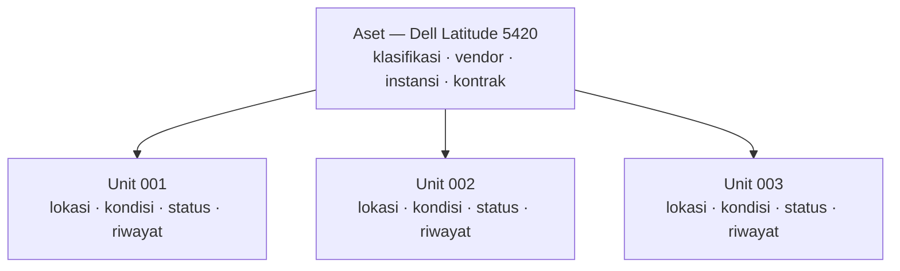

Aplikasi ini memisahkan **jenis barang** dari **barang satuannya**. Hampir setiap
layar, laporan, dan izin bergantung pada pemisahan itu, jadi pemahaman ini
sepadan dengan lima menit waktu Anda.

## Sebuah contoh

Instansi Anda membeli tiga laptop yang identik.

Anda membuat **satu aset**:

```text
Aset: Dell Latitude 5420
```

dan **tiga unit aset** di bawahnya:

```text
Aset: Dell Latitude 5420
├── Dell Latitude 5420 — Unit 001
├── Dell Latitude 5420 — Unit 002
└── Dell Latitude 5420 — Unit 003
```

Aset mencatat apa yang berlaku untuk ketiganya: klasifikasi, vendor (Dell),
instansi pemilik, dan kontrak pembeliannya.

Lalu kenyataan terjadi pada masing-masing:

| | Lokasi | Kondisi | Status siklus hidup |
|---|---|---|---|
| Unit 001 | Ruang 204 | `state:GOOD` | `state:lifecycle/ACTIVE` |
| Unit 002 | Gudang | `state:GOOD` | `state:IN_STORAGE` |
| Unit 003 | Dipegang pegawai | `state:FAIR` | `state:BORROWED` |

Tidak satu pun dari itu merupakan sifat "Dell Latitude 5420" sebagai model.
Semuanya adalah sifat satu mesin tertentu.

## Aturannya

> [!IMPORTANT]
> **Unit** adalah yang memiliki lokasi, kondisi, status siklus hidup, dan
> riwayat. **Aset** tidak memiliki satu pun di antaranya.



## Berdampingan

| | Aset | Unit Aset |
|---|---|---|
| Apa ini | Catatan induk untuk satu jenis barang | Satu barang fisik satuan |
| Jumlah | Satu catatan | Satu catatan per barang fisik |
| Lokasi | — | Ya |
| Kondisi | — | Ya |
| Status siklus hidup | — | Ya |
| Riwayat | — | Ya |
| Bisa dipinjam | — | Ya |
| Muncul pada transaksi | — | Ya |
| Bagian penanggung jawab | — | Ya |
| Klasifikasi | Ya | Mengikuti asetnya |
| Vendor | Ya | Mengikuti asetnya |
| Instansi | Ya | Mengikuti asetnya |
| Lampiran | Ya | — |
| Nilai atribut | Yang bertingkat aset | Yang bertingkat unit |

## Mengapa tidak mencatat barang satuan saja?

Karena fakta yang berlaku untuk seluruh batch akan tersimpan tiga kali dan lambat
laun berbeda. Ubah vendor pada satu laptop, dan dua lainnya diam-diam tidak lagi
sesuai.

## Mengapa tidak mencatat modelnya saja?

Karena Anda tidak bisa meminjamkan sebuah model, menaruhnya di sebuah ruangan,
atau mencatat bahwa ia terjatuh. Pertanggungjawaban membutuhkan barang satuan.

## Tampilannya di layar

Membuka sebuah aset menampilkan halaman dengan beberapa tab:

- **Info aset** — catatan induk, dan baris kontrak jika berasal dari kontrak
- **Unit** — barang fisik satuannya
- **Nilai atribut** — kolom tambahan untuk aset secara keseluruhan
- **Lampiran** — berkas

Memilih satu unit dari daftar itu membuka halaman unit tersebut, dengan tabnya
sendiri: **Ikhtisar**, **Nilai atribut**, **Riwayat**, **Peminjaman**,
**Transaksi**.

> [!TIP]
> Jika Anda mencari ruangan, kondisi, peminjaman, atau riwayat dan tidak
> menemukannya, Anda sedang berada di halaman aset padahal yang dibutuhkan adalah
> halaman unit. Buka tab **Unit** lalu pilih barangnya.

## Atribut ada di kedua tingkat

Kolom tambahan dikonfigurasi terhadap sebuah klasifikasi, dan masing-masing
dinyatakan melekat pada aset atau pada unit:

- **Atribut aset** menjelaskan jenis barangnya — ukuran layar, model prosesor.
  Sama untuk setiap unit.
- **Atribut unit** menjelaskan satu barang fisik — nomor seri, nomor inventaris.
  Berbeda untuk setiap unit.

Lihat [Atribut](/concepts/attributes).

## Aset tanpa unit

Diperbolehkan, dan artinya spesifik: sesuatu yang sudah didaftarkan tetapi belum
diterima secara fisik. Tab Unit yang kosong menyatakannya.

## Artikel terkait

- [Aset](/concepts/asset)
- [Unit Aset](/concepts/asset-unit)
- [Bagaimana cara menambahkan unit aset?](/how-do-i/add-an-asset-unit)
