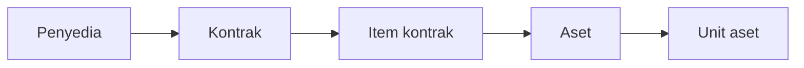

**Kontrak** adalah catatan pengadaan: perjanjian yang mendasari pembelian oleh
organisasi Anda. Ia adalah puncak rantai yang memasukkan sebagian besar aset ke
dalam registri.

Aplikasi mencatat kontrak. Ia tidak menerbitkan, menyetujui, atau memproses
pembayarannya — hal itu terjadi di tempat lain, dan yang Anda masukkan di sini
adalah catatan atas perjanjian yang sudah ada.

## Posisinya

## Isi sebuah kontrak

| Kolom | Wajib | Catatan |
|---|---|---|
| Nomor kontrak | Ya | Harus unik. Maksimal 150 karakter |
| Tanggal kontrak | Ya | Tanggal perjanjian |
| Penyedia | Tidak | Pihak yang menjalankannya bersama Anda |
| Jenis kontrak | Tidak | Dari daftar jenis milik Anda sendiri |
| Sumber dana | Tidak | Asal anggarannya |
| Nilai kontrak | Tidak | Angka, dua desimal |
| Kode rekening | Tidak | Dari daftar kode rekening milik Anda |
| Instansi | Tidak | Instansi penerima. Bawaannya instansi Anda |
| Dokumen penerimaan | Tidak | Rujukan berkas serah terima |
| Tanggal penerimaan | Tidak | Biarkan kosong sampai barang datang |
| Catatan | Tidak | Teks bebas |

Jenis kontrak, sumber dana, dan kode rekening adalah daftar yang Anda kelola
sendiri — lihat [Data referensi](/administration/reference-lookups). Penyedia,
jenis kontrak, dan sumber dana juga dapat dibuat tanpa meninggalkan formulir
kontrak.

## Diterima atau belum

**Tanggal penerimaan** adalah cara kontrak menyatakan apakah barangnya sudah
datang. Jika dibiarkan kosong, kontrak tampil sebagai *Belum diterima*. Ini
catatan fakta, bukan sakelar yang mengubah apa pun — mendaftarkan aset tidak
bergantung padanya.

## Item baris terpisah

Kontrak saja tidak membeli sesuatu yang tertentu. Apa yang sebenarnya dibeli
dicatat sebagai [item kontrak](/concepts/contract-item), ditambahkan setelah
kontraknya ada.

## Menyunting kontrak

Kontrak dapat disunting dengan bebas. Mengubah bagian utamanya — nilai, tanggal,
penyedia — tidak mengganggu item barisnya maupun aset yang ditelusuri darinya.

## Menonaktifkan

Kontrak dinonaktifkan, bukan dihapus. Aset yang sudah tertelusur ke sebuah
kontrak tetap mempertahankan kaitannya.

## Artikel terkait

- [Item kontrak](/concepts/contract-item)
- [Vendor vs Penyedia](/concepts/vendor-vs-supplier)
- [Bagaimana cara membuat kontrak?](/how-do-i/create-a-contract)
