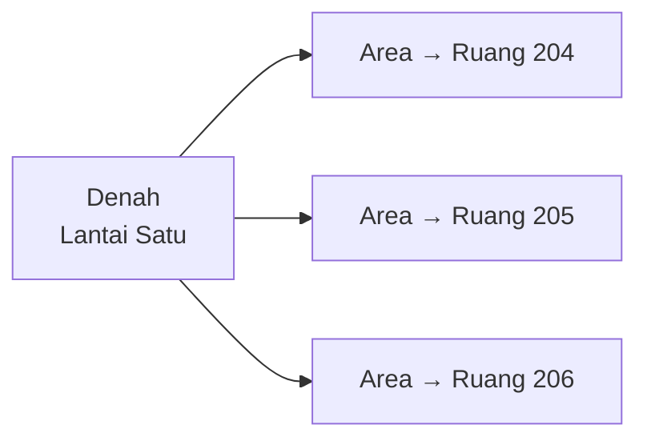

**Denah** adalah gambar milik sebuah [lokasi](/concepts/location), dengan
bentuk-bentuk yang digambar di atasnya. Setiap bentuk menandai sebuah lokasi yang
berada *di dalam* lokasi yang digambarkan denah tersebut.

Denah mengubah "Lemari A, Ruang 204, Lantai Satu" dari sebaris teks menjadi
sesuatu yang dapat Anda tunjuk.

## Bagaimana semuanya terkait

Sebuah denah milik satu lokasi. Bentuk-bentuk di atasnya — disebut **area** —
masing-masing mewakili satu lokasi yang bersarang di dalam lokasi itu.

Jadi denah sebuah lantai menandai ruangan-ruangannya; denah sebuah situs menandai
gedung-gedungnya. Lokasi mana pun dapat memiliki denah.

## Aturan keturunan

Sebuah area hanya boleh menunjuk lokasi yang benar-benar berada **di dalam**
lokasi pemilik denah — pada kedalaman berapa pun, tetapi harus di dalamnya.

> [!IMPORTANT]
> Anda tidak dapat menggambar ruangan dari gedung lain pada denah lantai ini.
> Aplikasi menolaknya, karena denah yang menandai tempat yang tidak dikandungnya
> justru akan menyesatkan.

## Jejak denah

Karena denah dibuat pada tingkat mana pun yang kebetulan difoto seseorang, denah
yang menempatkan sebuah unit biasanya berada **di atasnya** dalam hierarki.

Aplikasi menanganinya dengan menawarkan **jejak**: buka denah situs untuk melihat
gedung mana, lalu denah gedung untuk melihat ruangan mana, sejauh denah yang
tersedia. Setiap langkah menyorot langkah berikutnya ke dalam.

Tab Ikhtisar sebuah unit menampilkan jejak ini. Jika tidak ada denah pada tingkat
mana pun di atas unit tersebut, hal itu dinyatakan.

## Isi sebuah denah

| | |
|---|---|
| Gambar | Berkas JPEG atau PNG. Maksimal 10 MB |
| Area | Bentuk dengan minimal tiga sudut, masing-masing tertaut ke lokasi turunan |

Bentuk disimpan secara relatif terhadap gambar, bukan dalam piksel, sehingga
denah tetap sejajar baik di ponsel maupun di monitor besar.

## Menyunting area

> [!LIMITATION]
> Bentuk sebuah area tidak dapat disesuaikan sudut demi sudut. Untuk mengubah
> bentuk, Anda menghapus areanya lalu menggambarnya ulang. Dalam praktiknya ini
> gangguan kecil — ruangan jarang berpindah — tetapi siapkan waktu untuk
> menggambar ulang, bukan sekadar menggeser.

Menghapus area, atau seluruh denah, **tidak berpengaruh pada lokasinya sendiri**.
Denah adalah gambar dari hierarki, bukan hierarkinya.

## Mengganti denah

Mengunggah gambar baru menimpa denah yang ada akan menghapus setiap area yang
digambar pada denah lama. Hal itu tidak terhindarkan: bentuk-bentuk tersebut
diposisikan terhadap gambar yang lama. Bersiaplah menggambar ulang.

## Artikel terkait

- [Lokasi](/concepts/location)
- [Bagaimana cara mengunggah denah?](/how-do-i/upload-a-floor-plan)
- [Bagaimana cara membuat area pada denah?](/how-do-i/create-floor-plan-areas)
