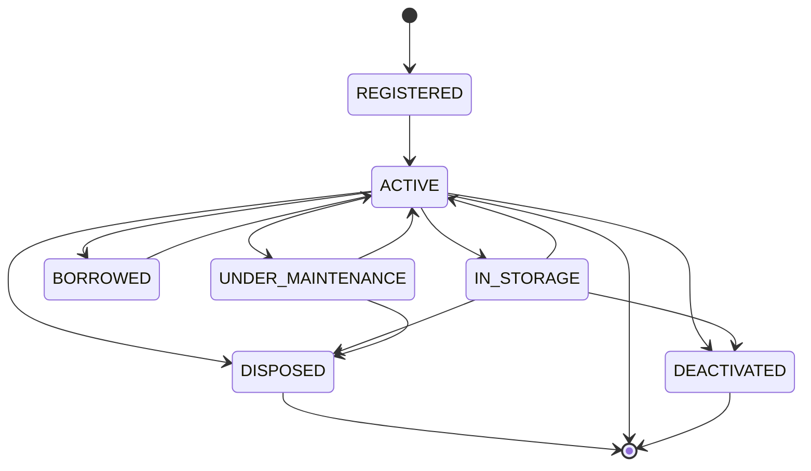

**Status siklus hidup** menyatakan posisi sebuah
[unit aset](/concepts/asset-unit) dalam masa pakainya. Ia menjawab "apakah barang
ini sedang dipakai?" — pertanyaan yang berbeda dari
[kondisi](/concepts/condition), yang menjawab "bagaimana keadaannya?".

Sebuah unit berada pada tepat satu status siklus hidup dalam satu waktu.

## Tujuh status

| Status | Artinya |
|---|---|
| `state:REGISTERED` | Sudah terdaftar, belum dioperasikan. Belum ada kondisi atau lokasi |
| `state:lifecycle/ACTIVE` | Sedang digunakan |
| `state:IN_STORAGE` | Disimpan sebagai cadangan, tidak sedang dipakai |
| `state:BORROWED` | Sedang dipinjam. Ditetapkan aplikasi, bukan secara manual |
| `state:UNDER_MAINTENANCE` | Sedang diperbaiki atau diservis |
| `state:DISPOSED` | Dihapuskan, dijual, atau dimusnahkan. Permanen |
| `state:DEACTIVATED` | Dikeluarkan dari daftar. Permanen |

## Perubahan mana yang diizinkan

Tidak setiap status dapat mengikuti status lain. Aplikasi menegakkan jalur tetap:

Dibaca secara praktis:

- Unit yang baru terdaftar hanya dapat menjadi **digunakan**. Semuanya dimulai
  dengan masuk ke layanan.
- **Digunakan** adalah simpulnya. Dari sana unit dapat masuk gudang, dipinjamkan,
  masuk perbaikan, atau keluar dari daftar sepenuhnya.
- Unit **di gudang** kembali digunakan, atau langsung keluar dari daftar.
- Unit **dipinjam** atau **dalam perbaikan** kembali ke penggunaan.
- Unit **dalam perbaikan** dapat dihapuskan bila ternyata tidak dapat
  diperbaiki.

> [!IMPORTANT]
> `state:DISPOSED` dan `state:DEACTIVATED` adalah akhir. Unit pada salah satunya
> tidak dapat berubah status lagi, selamanya. Hal itu disengaja — mengembalikannya
> akan menulis ulang riwayat yang seharusnya dijaga. Jika sesuatu benar-benar
> kembali digunakan, daftarkan sebagai unit baru.

Jika Anda mencoba perubahan yang tidak mungkin, aplikasi menolaknya dan
menyebutkan status mana saja yang *tersedia* dari posisi unit saat ini.

## Dua status yang tidak Anda tetapkan sendiri

- `state:BORROWED` ditetapkan saat sebuah [peminjaman](/concepts/borrowing)
  diaktifkan, dan dilepas saat pengembalian dicatat. Jangan menetapkannya secara
  manual; gunakan peminjamannya.
- `state:REGISTERED` adalah status saat unit dibuat.

## Mengubah status siklus hidup

Melalui **Catat perubahan** pada tab Riwayat unit, bersama kondisi dan lokasi.
Lihat
[Bagaimana cara mengubah status siklus hidup unit?](/how-do-i/change-a-unit-lifecycle-state).

## Status siklus hidup bukan aktif/nonaktif

Dua gagasan berbeda yang sama-sama memakai kata "aktif":

- **Status siklus hidup** menjelaskan masa pakai barang fisiknya.
- **[Aktif / nonaktif](/concepts/active-and-inactive)** menjelaskan apakah
  *catatannya* sedang dipakai.

Catatan sebuah unit dapat dinonaktifkan berapa pun status siklus hidupnya.

## Artikel terkait

- [Kondisi](/concepts/condition)
- [Riwayat](/concepts/history)
- [Rujukan status](/reference/statuses)
