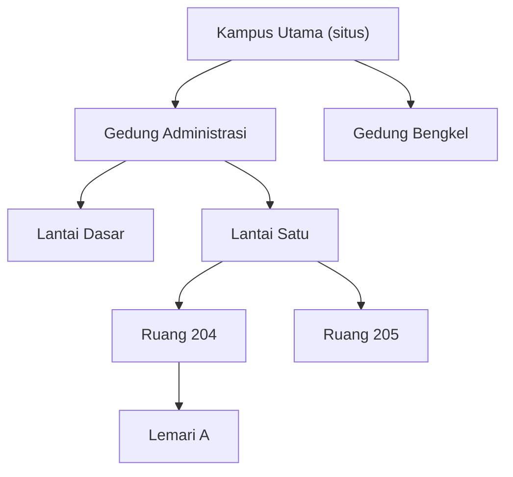

**Lokasi** adalah tempat sebuah [unit aset](/concepts/asset-unit) dapat berada.
Situs, gedung, lantai, ruangan, lemari — aplikasi tidak memaksakan sekumpulan
tingkat tertentu, dan Andalah yang menentukan seberapa rinci wilayah Anda dibagi.

## Lokasi bersarang

Setiap lokasi dapat berada di dalam lokasi lain. Sifat bersarang itulah
gagasan utamanya:

Lokasi tanpa induk adalah lokasi **tingkat atas** — biasanya sebuah situs atau
kampus. Selebihnya menyebut lokasi tempatnya berada.

Anda dapat menurun sedalam yang Anda anggap berguna. Tidak ada yang menghitung
tingkatnya, dan tidak ada keharusan memiliki susunan situs → gedung → lantai →
ruangan.

## Seberapa dalam sebaiknya?

Cukup dalam untuk menemukan barang, cukup dangkal untuk dipelihara. Pedoman yang
berguna: buat sebuah lokasi jika Anda akan pernah berkata "barangnya ada di
sana" dan berharap orang lain dapat berjalan ke sana.

Mencatat sebuah unit berada di "Gedung Administrasi" tetap sah jika memang
sedetail itulah catatan Anda.

## Isi sebuah lokasi

| | |
|---|---|
| Nama | Wajib |
| Klasifikasi | Wajib. Dari hierarki yang sama dengan aset, hanya tingkat paling rinci |
| Lokasi induk | Opsional. Kosong berarti tingkat atas |
| Instansi | Instansi pemiliknya |
| Denah | Opsional. Lihat [Denah](/concepts/floor-plan) |
| Unit | Semua yang tercatat di sana saat ini |
| Lokasi turunan | Semua yang tercatat di dalamnya |

## Dua cara bertanya "apa isinya?"

Tab **Unit** pada halaman lokasi memiliki pengatur cakupan dengan dua pilihan,
dan perbedaannya penting:

- **Di sini saja** — unit yang lokasinya tepat lokasi ini.
- **Termasuk di dalamnya** — unit di sini *dan* di setiap lokasi yang bersarang
  di dalamnya, pada kedalaman berapa pun.

Pilih "Termasuk di dalamnya" pada sebuah gedung untuk menginventarisasi seluruh
gedung. Pilih "Di sini saja" pada sebuah ruangan untuk melihat isi ruangan itu.
Lihat [Melihat isi sebuah lokasi](/locations/units-in-a-location).

## Lokasi tidak dapat saling melilit

Dua aturan mencegah hierarki melipat ke dalam dirinya sendiri:

- Sebuah lokasi tidak dapat menjadi induk bagi dirinya sendiri.
- Sebuah lokasi tidak dapat dipindahkan ke dalam salah satu turunannya.

Aturan kedua yang mungkin Anda temui: Anda tidak dapat menempatkan sebuah gedung
di dalam salah satu ruangannya sendiri.

## Menonaktifkan lokasi

Lokasi dinonaktifkan, tidak pernah dihapus. Unit yang tercatat di sana tetap
menyimpan riwayat lokasinya; lokasi tersebut berhenti ditawarkan untuk penempatan
baru. Lihat [Aktif dan nonaktif](/concepts/active-and-inactive).

## Bagaimana unit memperoleh lokasi

Bukan dengan menyunting unit. Lokasi sebuah unit adalah fakta historis, dicatat
melalui **Catat perubahan** pada tab Riwayatnya, bersama kondisi dan status
siklus hidup. Lihat
[Bagaimana cara memindahkan unit aset?](/how-do-i/move-an-asset-unit).

## Artikel terkait

- [Denah](/concepts/floor-plan)
- [Melihat isi sebuah lokasi](/locations/units-in-a-location)
- [Bagaimana cara membuat lokasi?](/how-do-i/create-a-location)
