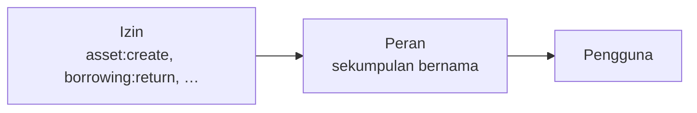

Akses diberikan dalam dua langkah: izin dimasukkan ke dalam peran, dan peran
diberikan kepada pengguna.

Tidak ada yang memegang izin secara langsung. Perantaraan itulah yang membuat
akses dapat dikelola: ubah perannya, dan semua pemegangnya ikut berubah.

## Izin

Sebuah izin menyebut satu tindakan pada satu jenis catatan, ditulis
`resource:action`: `perm:asset:read`, `perm:contract:create`,
`perm:borrowing:return`.

Jumlahnya **104**, dikelompokkan menurut modul — Organisasi, Referensi, Aset
Inti, Pengadaan, Operasional, Laporan, Audit. Daftar lengkapnya ada di
[Rujukan izin](/reference/permission-reference), dan layar peran menyajikannya
sebagai daftar centang berkelompok, bukan daftar datar.

Tindakan yang dipakai:

| Tindakan | Artinya |
|---|---|
| `read` | Melihat |
| `create` | Menambah baru |
| `update` | Mengubah yang sudah ada |
| `deactivate` | Menonaktifkan dan mengaktifkan kembali |
| `delete` | Menghapus permanen (hanya di tempat penghapusan memang ada) |
| Tindakan bernama | Operasi khusus: `activate`, `cancel`, `return`, `extend`, `record-history` |

Tindakan bernama itulah sebabnya peminjaman memiliki tujuh izin, bukan empat:
memberi wewenang "boleh membuat peminjaman" tidak sama dengan "boleh mencatat
pengembaliannya".

## Peran

Peran adalah sebuah nama beserta sekumpulan izin. Organisasi Anda membuat
perannya sendiri — tidak ada katalog jabatan baku, dan peran bernama
"Petugas Gudang" di satu instalasi mungkin tidak ada di instalasi lain.

Hanya satu peran yang tersedia bawaan: **System Admin**, bersifat menyeluruh dan
memegang seluruh izin. Ia tidak memiliki kekuatan khusus yang tertanam di
aplikasi; ia dapat melakukan segalanya karena memang *diberi* segalanya, yang
terlihat pada tab izinnya sendiri seperti peran lain.

## Peran menyeluruh

Sebuah peran dapat ditandai **menyeluruh** (*system-wide*). Ini menghapus batas
instansi dari izin yang dibawa peran tersebut — peran menyeluruh melihat catatan
seluruh instansi.

> [!IMPORTANT]
> Menyeluruh tidak memberi apa pun dengan sendirinya. Ia hanya menghapus
> pembatasan lingkup dari izin yang sudah dimiliki peran itu. Peran menyeluruh
> tanpa izin tetap tidak dapat melakukan apa-apa.

Sebagian izin hanya bermakna secara menyeluruh, dan layar peran menandainya
**Memerlukan peran menyeluruh**: membuat dan menyunting instansi maupun peran,
serta mengubah izin yang dibawa sebuah peran. Mematikan status menyeluruh akan
ditolak selama salah satu di antaranya masih diberikan.

*Membaca* peran tidak termasuk di dalamnya. Admin instansi dapat melihat peran
yang tersedia baginya beserta izin yang dibawa masing-masing — tanpa itu ia
membagikan akses tanpa tahu isinya.

## Memberikan peran kepada pengguna

Seorang pengguna dapat memegang peran sebanyak apa pun, dan izin efektifnya
adalah gabungan seluruh peran tersebut. Melepas semua peran menyisakan akun yang
dapat masuk tetapi tidak dapat melakukan apa pun.

Perubahan peran berlaku seketika — pengguna tidak perlu keluar lalu masuk lagi.

## Membiarkan instansi mengelola penggunanya sendiri

Peran selalu disusun secara terpusat: hanya admin menyeluruh yang membuatnya,
menyuntingnya, atau mengubah izin yang dibawanya. Namun sebuah instansi dapat
diberi kemampuan untuk **membagikan** peran yang sudah ada, sehingga instansi
tersebut dapat mendaftarkan stafnya sendiri tanpa harus meminta bantuan Anda
setiap kali.

Peran yang ditandai **dapat diberikan instansi** adalah peran yang boleh
diberikan admin instansi kepada pengguna di instansinya sendiri. Secara bawaan
tidak ada peran yang dapat diberikan; setiap peran harus dinyalakan dengan
sengaja.

Alurnya biasanya begini:

1. Anda membuat instansinya.
2. Anda membuat peran-peran yang dibutuhkan stafnya, lalu menandainya dapat
   diberikan instansi.
3. Anda membuat admin pertama instansi tersebut dan memberinya peran yang memuat
   pengelolaan pengguna.
4. Selanjutnya admin itu mendaftarkan penggunanya sendiri dan memberikan
   peran-peran yang dapat diberikan, tanpa perlu melibatkan Anda.

> [!WARNING]
> **Menandai sebuah peran dapat diberikan adalah pemberian hak akses, bukan
> sekadar pengaturan kemudahan.**
>
> Siapa pun yang membuat akun pengguna juga menetapkan kata sandinya, artinya ia
> dapat masuk sebagai akun tersebut. Jadi peran apa pun yang dapat diberikan
> seorang admin adalah peran yang dapat ia berikan kepada *dirinya sendiri* —
> cukup dengan membuat akun, memberikan peran itu, lalu masuk sebagai akun
> tersebut.
>
> Bacalah daftar peran yang dapat diberikan sebagai: "setiap admin instansi pada
> dasarnya memiliki izin-izin ini." Jika itu bukan yang Anda maksudkan untuk
> suatu peran, biarkan tetap mati.

Peran menyeluruh tidak akan pernah bisa ditandai dapat diberikan. Sistem menolak
kombinasi itu secara tegas — menyerahkan peran yang melampaui batas instansi
kepada admin instansi akan meruntuhkan batas tersebut sepenuhnya.

Admin instansi tidak melihat layar Peran. Mereka hanya bertemu peran pada pemilih
saat memberikan peran kepada pengguna, yang menampilkan persis apa yang boleh
mereka berikan.

## Menghapus peran

Peran adalah satu-satunya catatan keorganisasian yang benar-benar dihapus, bukan
dinonaktifkan. Penghapusan **ditolak selama masih ada pengguna yang memegangnya**,
jadi lepaskan dulu dari para pengguna.

## Artikel terkait

- [Memahami izin](/getting-started/understanding-permissions)
- [Bagaimana cara membuat peran?](/how-do-i/create-a-role)
- [Rujukan izin](/reference/permission-reference)
