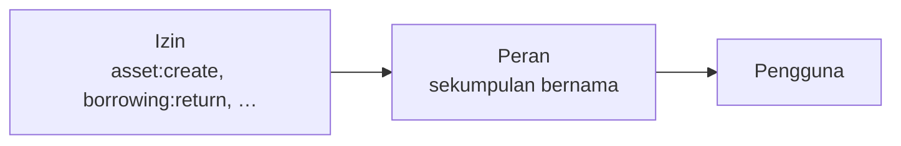

Akses diberikan dalam dua langkah: izin dimasukkan ke dalam peran, dan peran
diberikan kepada pengguna.

Tidak ada yang memegang izin secara langsung. Perantaraan itulah yang membuat
akses dapat dikelola: ubah perannya, dan semua pemegangnya ikut berubah.

## Izin

Sebuah izin menyebut satu tindakan pada satu jenis catatan, ditulis
`resource:action`: `perm:asset:read`, `perm:contract:create`,
`perm:borrowing:return`.

Jumlahnya **104**, dikelompokkan menurut modul — Organisasi, Referensi, Aset
Inti, Pengadaan, Operasional, Laporan, Audit. Daftar lengkapnya ada di
[Rujukan izin](/reference/permission-reference), dan layar peran menyajikannya
sebagai daftar centang berkelompok, bukan daftar datar.

Tindakan yang dipakai:

| Tindakan | Artinya |
|---|---|
| `read` | Melihat |
| `create` | Menambah baru |
| `update` | Mengubah yang sudah ada |
| `deactivate` | Menonaktifkan dan mengaktifkan kembali |
| `delete` | Menghapus permanen (hanya di tempat penghapusan memang ada) |
| Tindakan bernama | Operasi khusus: `activate`, `cancel`, `return`, `extend`, `record-history` |

Tindakan bernama itulah sebabnya peminjaman memiliki tujuh izin, bukan empat:
memberi wewenang "boleh membuat peminjaman" tidak sama dengan "boleh mencatat
pengembaliannya".

## Peran

Peran adalah sebuah nama beserta sekumpulan izin. Organisasi Anda membuat
perannya sendiri — tidak ada katalog jabatan baku, dan peran bernama
"Petugas Gudang" di satu instalasi mungkin tidak ada di instalasi lain.

Hanya satu peran yang tersedia bawaan: **System Admin**, bersifat menyeluruh dan
memegang seluruh izin. Ia tidak memiliki kekuatan khusus yang tertanam di
aplikasi; ia dapat melakukan segalanya karena memang *diberi* segalanya, yang
terlihat pada tab izinnya sendiri seperti peran lain.

## Peran menyeluruh

Sebuah peran dapat ditandai **menyeluruh** (*system-wide*). Ini menghapus batas
instansi dari izin yang dibawa peran tersebut — peran menyeluruh melihat catatan
seluruh instansi.

> [!IMPORTANT]
> Menyeluruh tidak memberi apa pun dengan sendirinya. Ia hanya menghapus
> pembatasan lingkup dari izin yang sudah dimiliki peran itu. Peran menyeluruh
> tanpa izin tetap tidak dapat melakukan apa-apa.

Sebagian izin hanya bermakna secara menyeluruh, dan layar peran menandainya
**Memerlukan peran menyeluruh**: mengelola instansi, mengelola peran, mengelola
katalog izin, dan menetapkan peran kepada pengguna. Mematikan status menyeluruh
akan ditolak selama salah satu di antaranya masih diberikan.

## Memberikan peran kepada pengguna

Seorang pengguna dapat memegang peran sebanyak apa pun, dan izin efektifnya
adalah gabungan seluruh peran tersebut. Melepas semua peran menyisakan akun yang
dapat masuk tetapi tidak dapat melakukan apa pun.

Perubahan peran berlaku seketika — pengguna tidak perlu keluar lalu masuk lagi.

## Menghapus peran

Peran adalah satu-satunya catatan keorganisasian yang benar-benar dihapus, bukan
dinonaktifkan. Penghapusan **ditolak selama masih ada pengguna yang memegangnya**,
jadi lepaskan dulu dari para pengguna.

## Artikel terkait

- [Memahami izin](/getting-started/understanding-permissions)
- [Bagaimana cara membuat peran?](/how-do-i/create-a-role)
- [Rujukan izin](/reference/permission-reference)
