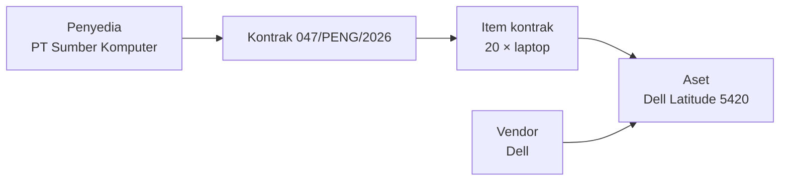

Dua kata yang terdengar dapat dipertukarkan padahal tidak. Aplikasi menyimpan
daftar terpisah untuk keduanya karena masing-masing menjawab pertanyaan berbeda.

## Perbedaannya

| | Vendor | Penyedia |
|---|---|---|
| Siapa | **Pabrikan atau merek** | **Pihak yang menandatangani kontrak dengan Anda** |
| Menjawab | Siapa yang membuat barang ini? | Dari siapa kita membelinya? |
| Melekat pada | Sebuah [aset](/concepts/asset) | Sebuah [kontrak](/concepts/contract) |
| Berada di | Operasional → Vendor | Pengadaan → Penyedia |
| Contoh | Dell | PT Sumber Komputer |

## Sebuah contoh

Instansi Anda membeli dua puluh laptop Dell melalui penyedia lokal berdasarkan
kontrak `047/PENG/2026`.

- **Penyedia** adalah perusahaan yang memenangkan tender dan mengantarkannya.
  Dicatat pada kontrak.
- **Vendor** adalah Dell. Dicatat pada aset.

Tahun berikutnya Anda membeli laptop Dell lagi melalui perusahaan yang berbeda.
Vendornya sama; penyedianya tidak. Memisahkan keduanya memungkinkan Anda bertanya
"berapa banyak peralatan Dell yang kita miliki?" sekaligus "apa saja yang pernah
kita beli dari perusahaan ini?"

Penyedia mencapai aset **melalui kontrak**. Vendor melekat langsung pada aset.

## Ketika tidak ada vendor

Selalu opsional. Biarkan pada *Tanpa vendor* jika pabrikannya tidak diketahui,
tidak relevan, atau barangnya dibuat sendiri. Tidak ada yang bergantung pada
kolom ini terisi.

## Ketika tidak ada penyedia

Juga mungkin. Sebuah kontrak dapat dicatat tanpa menyebut penyedia, dan aset yang
didaftarkan secara langsung tidak memiliki kontrak sama sekali — jadi tidak ada
penyedia pula. Barang hibah, buatan sendiri, dan hasil migrasi adalah kasus yang
biasa.

## Isi masing-masing catatan

Keduanya adalah catatan ringkas dengan tiga kolom yang sama:

| Kolom | Wajib | Catatan |
|---|---|---|
| Nama | Ya | Maksimal 255 karakter |
| Informasi kontak | Tidak | Teks bebas — telepon, surel, narahubung |
| Alamat | Tidak | Teks bebas |

## Isi masing-masing halaman

- Halaman **vendor** menampilkan aset yang diatribusikan kepadanya, dalam lingkup
  organisasi Anda. Berguna untuk "peralatan Dell apa saja yang kita punya?".
- Halaman **penyedia** menampilkan kontrak yang dijalankan dengannya. Berguna
  untuk "apa saja yang pernah kita beli dari perusahaan ini?".

## Menonaktifkan

Keduanya dinonaktifkan, bukan dihapus. Catatan yang sudah ada tetap
mempertahankan rujukannya; entrinya berhenti ditawarkan pada catatan baru.
Mengaktifkan kembali membuatnya dapat dipilih lagi.

## Artikel terkait

- [Kontrak](/concepts/contract)
- [Bagaimana cara membuat penyedia?](/how-do-i/create-a-supplier)
- [Bagaimana cara membuat vendor?](/how-do-i/create-a-vendor)
