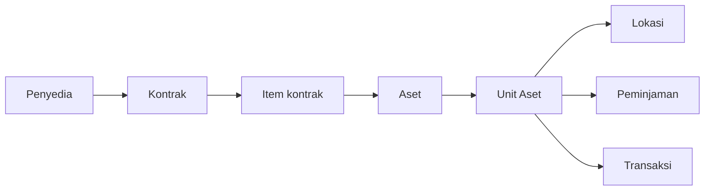

Sistem Manajemen Aset adalah catatan resmi atas barang fisik milik organisasi
Anda — komputer, mebel, kendaraan, peralatan, dan perlengkapan yang dimiliki
sebuah instansi dan harus dipertanggungjawabkan.

Untuk setiap barang tersebut, aplikasi ini menjawab:

- Barang apa ini, dan termasuk jenis apa?
- Instansi mana pemiliknya, dan bagian mana yang bertanggung jawab?
- Di mana barangnya sekarang?
- Bagaimana kondisinya?
- Dari mana asalnya — kontrak yang mana, penyedia yang mana?
- Apakah sedang dipinjam seseorang?
- Apa saja yang telah terjadi sejak barang itu didaftarkan?

## Untuk siapa panduan ini

Siapa pun yang menggunakan aplikasi: staf yang mendaftarkan barang datang, orang
yang memindahkan barang antar ruangan dan mencatat kondisinya, siapa pun yang
meminjamkan peralatan dan menagihnya kembali, serta administrator yang mengatur
semuanya.

Anda tidak perlu memahami basis data atau pemrograman untuk menggunakan panduan
ini. Jika aplikasi melakukan sesuatu karena alasan teknis, panduan ini
menjelaskan artinya bagi Anda, bukan alasan pembuatannya.

## Bentuk sistemnya

Semua isi aplikasi bertumpu pada dua gagasan yang tampak mirip padahal berbeda:

- **Aset** adalah catatan induk untuk satu *jenis* barang — "laptop Dell Latitude
  5420".
- **Unit Aset** adalah satu barang fisik dari jenis itu — laptop yang benar-benar
  ada di atas meja di Ruang 204.

> [!IMPORTANT]
> Aset dan Unit Aset adalah perbedaan terpenting di aplikasi ini. Hampir setiap
> pertanyaan yang diawali "kenapa saya tidak bisa…" berujung pada tertukarnya
> kedua hal ini. Bacalah
> [Aset vs Unit Aset](/concepts/asset-vs-asset-unit) sebelum yang lain.

Di sekitar keduanya, bagian sistem lainnya tersusun seperti ini:

Bacalah sebagai satu kalimat: Anda membeli barang dari **penyedia** melalui
sebuah **kontrak**; setiap baris kontrak itu adalah **item kontrak**;
mendaftarkan satu baris memasukkan **aset** ke dalam registri beserta
**unit**-unitnya; setiap unit berada di sebuah **lokasi**, dapat **dipinjam**,
dan mengumpulkan **transaksi**.

Tidak semua barang datang lewat jalur itu. Barang hibah, barang buatan sendiri,
dan barang warisan didaftarkan secara langsung tanpa kontrak — itu kasus normal
yang memang diperkirakan, bukan data yang kurang.

## Yang bukan tugas aplikasi ini

- Ini bukan sistem pembelian. Aplikasi mencatat kontrak yang sudah ada; ia tidak
  menerbitkan pesanan atau menyetujui anggaran.
- Ini bukan buku besar akuntansi. Aplikasi mencatat nilai kontrak dan kode
  rekening, tetapi tidak menghitung penyusutan atau penilaian.
- Ini bukan penjadwal pemeliharaan. Anda dapat mencatat bahwa sebuah unit sedang
  diperbaiki; aplikasi tidak akan mengingatkan jadwal servis.

## Selanjutnya ke mana

- [Masuk ke aplikasi](/getting-started/signing-in) — cara masuk.
- [Mengenali navigasi](/getting-started/finding-your-way-around) — bilah sisi,
  pencarian, dan bentuk sebuah layar.
- [Bagaimana Cara…?](/how-do-i) — petunjuk langkah demi langkah.
