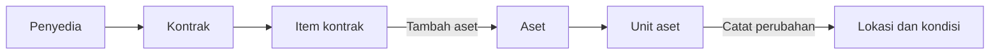

## Untuk apa ini

Inilah cara utama barang masuk ke registri. Alih-alih mengetik aset dari nol lalu
berusaha mengingat kontrak asalnya, Anda mendaftarkannya **dari** baris
kontraknya — dan kaitan antara keduanya dibuatkan untuk Anda.

Gunakan [Membuat aset](/how-do-i/create-an-asset) untuk barang yang tidak
memiliki kontrak di belakangnya.

## Sebelum memulai

- Kontraknya harus ada, beserta item baris yang akan Anda daftarkan.
- Anda memerlukan **klasifikasi** untuk barang tersebut. Baris kontrak tidak
  membawanya, jadi itulah satu-satunya hal yang harus Anda sediakan di sini.
- Ketahui **berapa unit yang benar-benar datang**. Jumlahnya tidak harus sama
  dengan kuantitas yang dipesan.

## Langkah-langkah

1. Buka **Pengadaan › Kontrak** lalu pilih kontraknya.
2. Temukan item barisnya pada tabel **Item baris**.
3. Pilih **Tambah aset** pada baris tersebut.
4. Periksa **Nama** — terisi otomatis dari item baris dan dapat disunting.
5. Pilih **Klasifikasi**. Hanya tingkat paling rinci yang dapat dipilih.
6. Pilih **Vendor** bila ingin mencatat pabrikannya.
7. Tetapkan **Unit aset yang didaftarkan**. Terisi otomatis dengan kuantitas yang
   dipesan.
8. Tambahkan **Deskripsi** bila membantu.
9. Pilih **Buat aset**.

## Rujukan kolom

| Kolom | Wajib | Catatan |
|---|---|---|
| Nama | Ya | Terisi otomatis dari item baris. Maksimal 255 karakter |
| Klasifikasi | Ya | Baris kontrak tidak membawanya, jadi dipilih di sini. Hanya tingkat paling rinci |
| Vendor | Tidak | Pabrikan atau merek |
| Unit aset yang didaftarkan | Ya | Bilangan bulat 1 sampai 500. Terisi otomatis dengan kuantitas yang dipesan |
| Deskripsi | Tidak | Maksimal 5.000 karakter |

> [!TIP]
> Mendaftarkan unit lebih sedikit daripada yang dipesan adalah hal biasa, bukan
> kesalahan. Pengiriman sebagian memang diperkirakan — daftarkan yang sudah
> datang, dan daftarkan sisanya pada item baris yang sama ketika barangnya tiba.

## Apa yang terjadi setelahnya

Dalam satu langkah aplikasi membuat:

- **Satu aset**, yang sudah tertelusur ke kontrak ini. Halaman detailnya
  menampilkan nomor kontrak, tanpa Anda perlu mengetiknya.
- **Sebanyak unit aset** yang Anda minta, masing-masing membawa baris kontrak
  asalnya.

Setiap unit dimulai pada `state:REGISTERED` tanpa kondisi dan tanpa lokasi,
persis seperti bila Anda menambahkannya manual. Langkah berikutnya pun sama:
catat kondisi dan lokasi pertama setiap unit untuk mengoperasikannya.

Panel item baris kini menampilkan unit yang terdaftar terhadapnya, sehingga Anda
dapat melihat sekilas berapa banyak pesanan yang benar-benar sudah datang.

## Alur kerja yang lebih luas

## Tugas terkait

- [Bagaimana cara membuat aset?](/how-do-i/create-an-asset)
- [Bagaimana cara menetapkan lokasi?](/how-do-i/assign-a-location)
