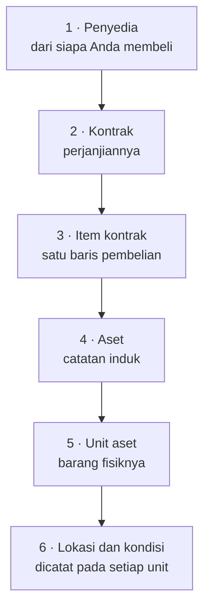

Inilah cara utama barang masuk ke registri. Lima catatan, berurutan,
masing-masing dibuat dari yang sebelumnya.

Manfaat mengikuti urutan ini adalah setiap langkah **mengisikan langkah
berikutnya untuk Anda**. Daftarkan aset dari baris kontrak dan kaitannya kembali
ke kontrak terbentuk otomatis — Anda tidak pernah mengetik nomor kontrak pada
sebuah aset, dan laporan **Ketertelusuran pengadaan** berfungsi tanpa ada yang
memeliharanya.

## Langkah demi langkah

### 1. Penyedia

Catat dari siapa Anda membeli, bila belum terdaftar. Lihat
[Bagaimana cara membuat penyedia?](/how-do-i/create-a-supplier).

Penyedia juga dapat dibuat dari dalam formulir kontrak, sehingga penyedia yang
belum ada tidak menghentikan pekerjaan Anda.

### 2. Kontrak

Catat perjanjiannya: nomor, tanggal, nilai, sumber dana. Lihat
[Bagaimana cara membuat kontrak?](/how-do-i/create-a-contract).

Pada titik ini belum ada barang tertentu yang dibeli. Kontrak baru berupa bagian
utamanya.

### 3. Item baris

Catat apa yang sebenarnya dibeli, satu baris per jenis barang: "20 laptop",
"5 lemari arsip". Lihat
[Bagaimana cara menambahkan item kontrak?](/how-do-i/add-contract-items).

Cara Anda memecah baris menentukan bentuk registri Anda, karena setiap baris akan
menjadi satu aset.

### 4 dan 5. Aset beserta unitnya

Ketika barang datang, gunakan **Tambah aset** pada item barisnya. Dalam satu
langkah, [aset](/concepts/asset) dan sebanyak
[unit](/concepts/asset-unit) yang benar-benar tiba akan dibuat. Lihat
[Bagaimana cara mendaftarkan aset dari kontrak?](/how-do-i/register-an-asset-from-a-contract).

Satu-satunya hal yang harus Anda sediakan di sini adalah
[klasifikasi](/concepts/classification) — dokumen kontrak tidak memuatnya.

### 6. Mengoperasikan unitnya

Unit yang baru dibuat berstatus `state:REGISTERED` tanpa kondisi dan tanpa
lokasi. Catat perubahan pertama setiap unit untuk mengoperasikannya. Lihat
[Bagaimana cara mencatat perubahan pada unit aset?](/how-do-i/record-a-change-to-a-unit).

Barulah setelah itu barangnya benar-benar tercatat di registri: dapat ditemukan
menurut lokasi, dilaporkan menurut kondisi, dan tersedia untuk dipinjam.

## Pengiriman sebagian

Kuantitas pada item baris adalah jumlah yang **dipesan** dan tidak pernah
berubah. Unit yang Anda daftarkan adalah yang **datang**.

> [!IMPORTANT]
> Mendaftarkan unit lebih sedikit daripada yang dipesan memang diperkirakan,
> bukan kesalahan. Daftarkan yang sudah datang, dan daftarkan sisanya pada item
> baris yang sama ketika barangnya tiba. Panel item baris menampilkan kedua
> angkanya, sehingga selisihnya adalah pengiriman yang masih tertunggak.

## Ketika tidak ada kontrak

Banyak barang tidak dibeli: hibah, barang buatan sendiri, barang alihan, atau
catatan yang dipindahkan dari sistem lama. Semuanya didaftarkan secara langsung
dan sama sekali tidak memiliki catatan pengadaan — kasus normal yang
terdokumentasi. Lihat
[Bagaimana cara mendaftarkan aset secara langsung?](/how-do-i/register-an-asset-directly).

> [!NOTE]
> Memilih jalur langsung bukan keputusan final. Kontrak masih dapat dilampirkan
> ke aset kemudian melalui formulir ubahnya, dan setiap unit dapat diarahkan ke
> rincian kontrak asalnya melalui formulir ubah unit. Mendaftarkan dari kontrak
> sejak awal tetap jalur terpendek: sekali jalan, kaitannya terbentuk untuk semua
> unit.

## Memeriksa apa yang sudah tertelusur

Laporan **Ketertelusuran pengadaan** menunjukkan aset mana yang tertelusur ke
sebuah kontrak dan berapa banyak unitnya yang membawa item baris tersebut —
itulah cara menemukan barang yang didaftarkan langsung padahal seharusnya
didaftarkan dari kontrak. Lihat
[Delapan laporan](/reports/the-eight-reports).

## Artikel terkait

- [Kontrak](/concepts/contract)
- [Item kontrak](/concepts/contract-item)
- [Vendor vs Penyedia](/concepts/vendor-vs-supplier)
